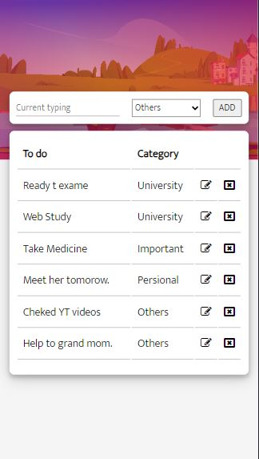

# My Awesome Web-based To-Do App

Welcome to my awesome web-based to-do app! This project was built with JavaScript and designed to help you stay organized and productive.

## Features

- Intuitive and user-friendly interface for easy task management.
- Add, edit, and delete tasks effortlessly with just a few clicks.
- Organize tasks into different categories or lists.
- Mark tasks as completed to track your progress.
- Responsive design for seamless usage on both mobile and desktop devices.

## Screenshots

### Mobile View

## Getting Started

To get started with the app, you can visit the live demo [here](https://pathugit.github.io/todo-app/) and start managing your tasks immediately.

## Installation

1. Clone the repository: `git clone https://github.com/pathuGIT/todo-app.git`
2. Navigate to the project directory: `cd todo-app`
3. Open the `index.html` file in your favorite web browser.

## Feedback

I would love to hear your feedback and suggestions. Feel free to open an issue on the GitHub repository or reach out to me at pathumwannige@gmail.com.

## License

This project is licensed under the [MIT License](LICENSE).
